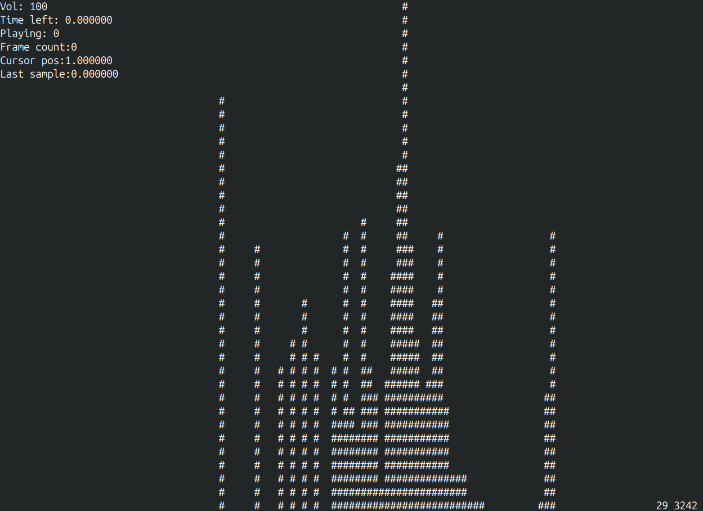

# cmd_eq

Terminal audio player in C++ with ncurses UI.

<p align="center">
  
</p>

## Features
- Audio playback (miniaudio)
- Keyboard control
- Lock-free audio ↔ UI communication
- Audio visualisation (to be implemented)

## Architecture
- Renderer — input + rendering
- AudioPlayer — audio thread
- Coordinator — main loop
- Shared atomic state + command channel

## Build
```bash
mkdir build 
cd build
cmake -G ninja ..
ninja
```
## TODO
- [x] Audio class
- [x] Renderer class
- [x] UI class  
- [x] Data bus between above
- [x] Data bus for controls
- [ ] Metadata parsing
- [x] FFT for visualisation
- [ ] Somewhat UI
- [x] Audio visualisation
- [ ] Config file
- [ ] Reading playlist from dir  
- [ ] Actual UI with visualisation


